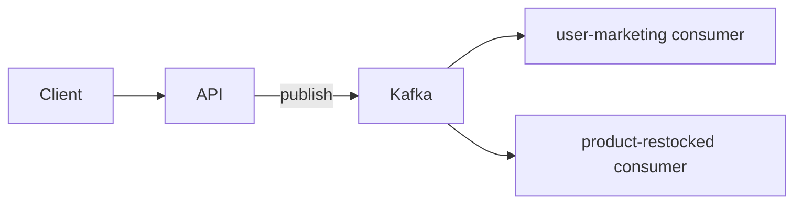

# node-distributed-monolith

A TypeScript starter for a **distributed monolith**: one codebase, one Docker image, multiple independently deployable processes (HTTP API + Kafka consumers).

The API handles HTTP traffic and publishes domain events. Consumers subscribe to Kafka topics and run side effects asynchronously. Shared Kafka helpers and message types live in `src/shared/`.

## Architecture



| Process | Role | Entrypoint |
|---------|------|------------|
| API | HTTP server, publishes events | `src/api/app.ts` |
| `user-marketing-consumer` | Handles marketing consent updates | `src/consumers/user-marketing-consumer/index.ts` |
| `product-restocked-consumer` | Handles product restock notifications | `src/consumers/product-restocked/index.ts` |

In production, each process is a separate ECS service running the **same ECR image** with a different command. Locally, docker compose runs the same topology with hot reload.

## Project layout

```
src/
  api/                    # Express HTTP API
    modules/              # Feature modules (user, product, …)
    lib/kafka.ts          # API-scoped Kafka producer instance
    __tests__/            # API tests
  consumers/
    user-marketing-consumer/
    product-restocked/
  shared/kafka/           # Producer, consumer, topics, message types
```

Path aliases: `@api/*`, `@consumers/*`, `@shared/*` (see `tsconfig.json`).

## Kafka topics

| Topic | Published by | Consumed by |
|-------|--------------|-------------|
| `user-marketing-consent` | `POST /api/user/:id/marketing-consent` | `user-marketing-consumer` |
| `product-restocked` | `POST /api/product/:id/restock` | `product-restocked-consumer` |

Topics are created on startup by the `kafka-init` compose service (`scripts/kafka/create-topics.sh`). Keep that script in sync with `src/shared/kafka/topics.ts`.

## Local development

**Prerequisites:** Docker, Node 22 (for lint/test outside compose).

```bash
npm install
npm run dev        # docker compose up --build
```

This starts the API (port 3000), both consumers, Kafka, and topic initialization.

| Service | URL / notes |
|---------|-------------|
| API | http://localhost:3000 |
| Kafka | `kafka:9092` inside the compose network |

Compose uses the Dockerfile `development` stage with bind mounts and `tsx watch` for hot reload. After adding npm packages locally, reset volumes:

```bash
npm run compose:down && npm run dev
```

### Example requests

```bash
# Update marketing consent (publishes to user-marketing-consent)
curl -X POST http://localhost:3000/api/user/1/marketing-consent \
  -H 'Content-Type: application/json' \
  -d '{"accepts_marketing": true}'

# Restock a product (publishes to product-restocked)
curl -X POST http://localhost:3000/api/product/1/restock \
  -H 'Content-Type: application/json' \
  -d '{"quantity": 60}'
```

## Scripts

| Command | Description |
|---------|-------------|
| `npm run dev` | Start full stack via docker compose |
| `npm run compose:down` | Tear down compose (including volumes) |
| `npm run compile` | TypeScript build → `dist/` |
| `npm run lint` | ESLint |
| `npm run test` | Vitest unit tests |
| `npm run format` | Prettier |

## Testing

Tests live in a `__tests__/` folder per deployable unit:

- `src/api/__tests__/`
- `src/consumers/<name>/__tests__/`

`tsconfig.json` includes tests for editor support; `tsconfig.build.json` excludes them from production output.

## CI/CD

On every push/PR to `main`:

- **Lint** and **test** run in parallel.

On push to `main` (after lint and test pass):

- **Build and push** a production Docker image (`runtime` stage) to Amazon ECR, tagged with the git SHA.

Required repository secrets: `AWS_ROLE_ARN`, `AWS_REGION` (OIDC auth to AWS — no long-lived access keys in the workflow).

## Production

See [docs/deployment.md](docs/deployment.md) for the full production picture: ECR → ECS, MSK, per-service command overrides, and configuration.

Quick mental model:

```
GitHub Actions → ECR (one image) → ECS (api + consumer services) → MSK
```

Compilation happens inside the Docker `build` stage — there is no separate compile job in CI.

## Docker image stages

| Stage | Purpose |
|-------|---------|
| `development` | Local compose — source, dev deps, `tsx watch` |
| `build` | Compiles TypeScript |
| `runtime` | Production — compiled `dist/` + prod `node_modules` |

Default `CMD` starts the API. Consumers override the command at deploy time.
